## Chatbot for home automation

This repository hosts to code and instructions to build a home automation chatbot using PubNub ChatEngine and IBM Watson conversation service.


#### Prerequisites

Before you start working on building this chatbot, make sure that the following requirements are satisfied.

* If not done already, follow the links below to create the respective accounts.

 * Create account on [PubNub](https://admin.pubnub.com/)
 * Create account on [IBM Cloud](https://console.bluemix.net/)


* Make sure Node.js is installed on your computer.

 * [Node.js V6.11.1+](https://nodejs.org/en/)

#### Steps

Follow the steps below to build yourself a chatbot to chat with your home.

### Create IBM Watson conversation service

##### Step 1

Login to IBM cloud with your IBM login ID.  Go to catalog, then select **Conversation** under Watson services.

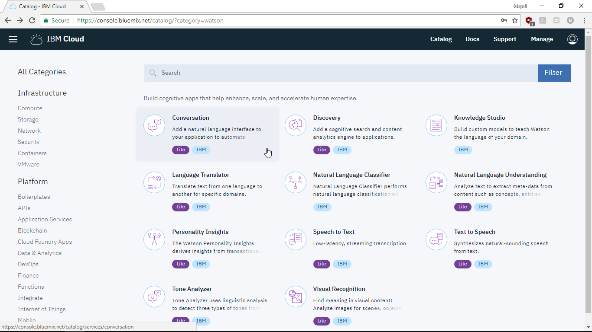


###### Step 2:


Enter a name for the service. Leave other fields to their default values.


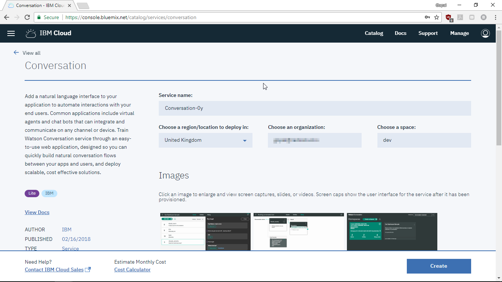


Scroll down and select 'Lite pricing plan' and then click on 'Create'.

 _The pricing plans shown to you may differ based on your IBM account type, region or other details_


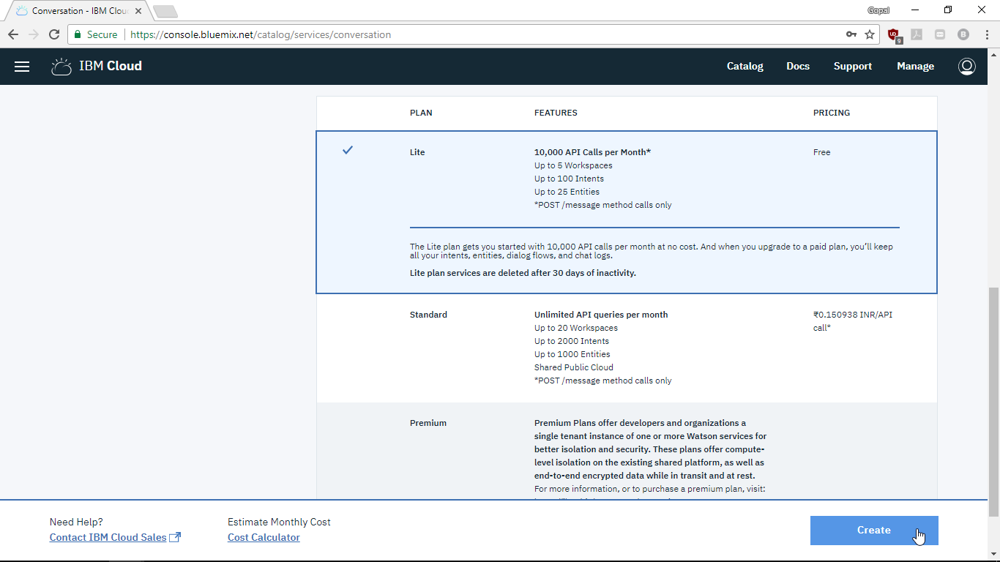


###### Step 3:

From the service page, go to 'Service credentials' and click on 'New credentials'.


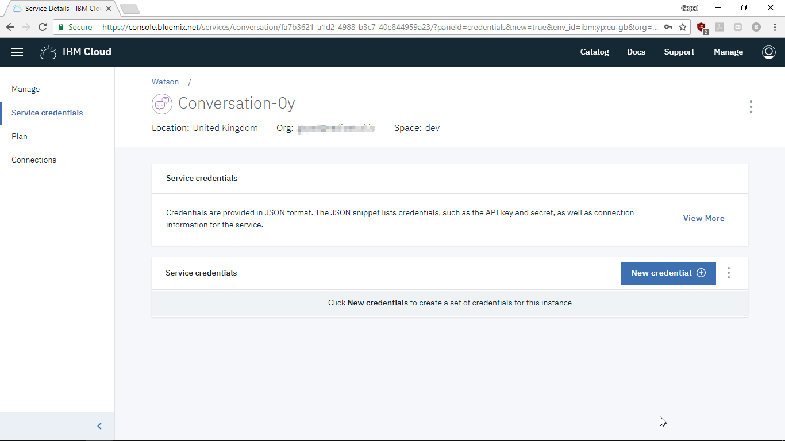


On the 'Add new credential' dialog box, enter a name for the credentials or use the default name and click on 'Add'

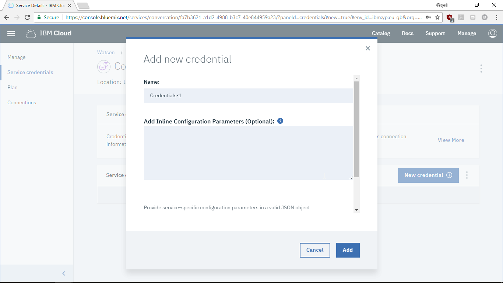


###### Step 4:

Your IBM Watson conversation service and the credentials to access the service are created now. Copy the username and password from these credentials to a file on your computer. We will use them later while configuring PubNub function.

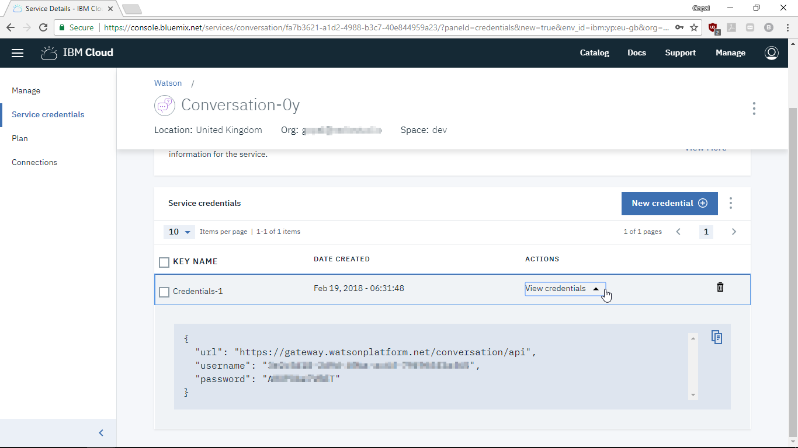


### Configure Watson conversation services

###### Step 5:

* Clone this repository with `git clone` or download zip file from GitHub.

* Open a terminal (or command prompt in Windows) on your computer.

* Navigate to the root folder of this cloned repository and then install required packages with the command:

```shell
npm install --save
```

###### Step 6:

* In the folder [watson-chatbot](watson-chatbot) in this cloned repository, create a file named `.env`.

* Put your Watson conversation service credentials obtained earlier in this `.env` file in the following format.

```javascript
watson_conv_username='YOUR_WATSON_CONVERSATION_USER_NAME_CREDENTIAL'
watson_conv_password='YOUR_WATSON_CONVERSATION_PASSWORD_CREDENTIAL'
```
Note that the user name and password are different from your IBM login id and password.

Your completed `.env` file should look like this:

```javascript
watson_conv_username='5e1b5d20-2g9q-29ab-ga6f-26f465f3a2g5'
watson_conv_password='Q6GROTe7HB4N'
```

###### Step 7:

* From the terminal, change directory to [watson-chatbot](watson-chatbot) and execute the script `updatebot.js` which creates a workspace within your Watson conversation service and creates required entities, intents and dialogs.

The script will then output a message about creation of workspace in Watson conversation service. Copy the workspace id shown in the output on your terminal. We will need this id later.

```shell
cd  watson-chatbot
node updatebot.js
Created workspace: 1290c543-13f3-2893-g627-9f74k716t361
```

### Configure PubNub ChatEngine

Now that we have created a conversation service on IBM Watson, your PubNub account needs to be configured with a couple of functions required for ChatEngine and also to access the Watson conversation service.

###### Step 8:

Login to [PubNub](https://admin.pubnub.com) with your credentials and then head to this link -[https://www.pubnub.com/docs/tutorials/chatengine#step-one-pubnub-keys](https://www.pubnub.com/docs/tutorials/chatengine#step-one-pubnub-keys). Click on the 'Setup' button on this page to let PubNub automagically create a new app with all required functions for the ChatEngine. Once the setup is done, a success message will be shown.

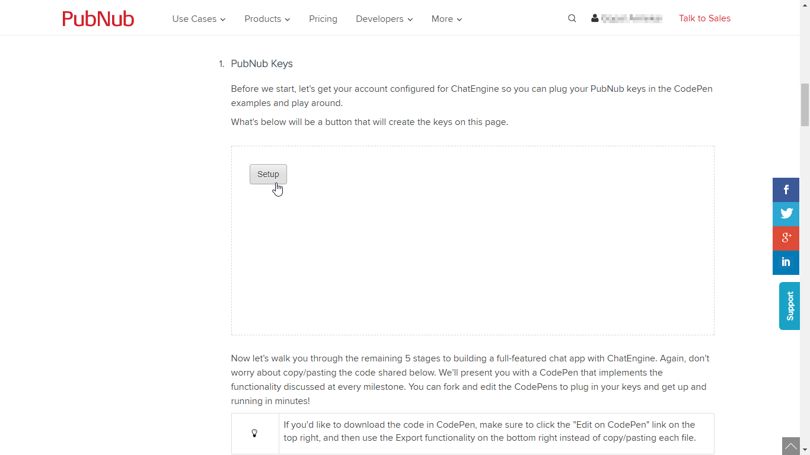

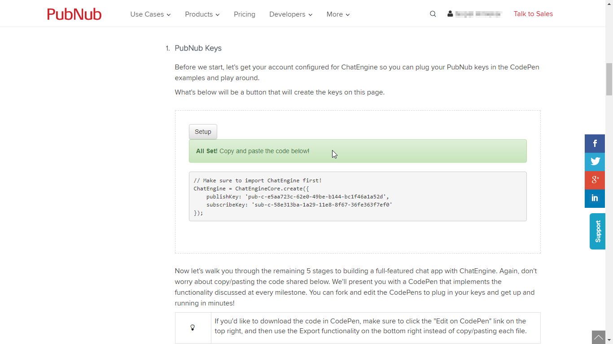


###### Step 9:

* Head back to your PubNub dashboard at https://admin.pubnub.com. You should see a new ChatEngine app created for you.

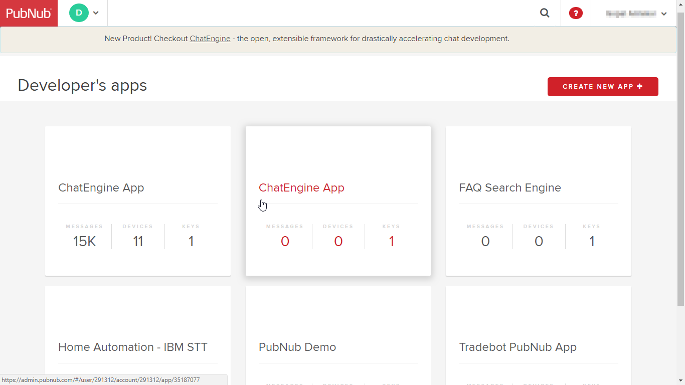


* Click on the app and you can see the publish, subscribe keys created for the app as well. Click on the keys.

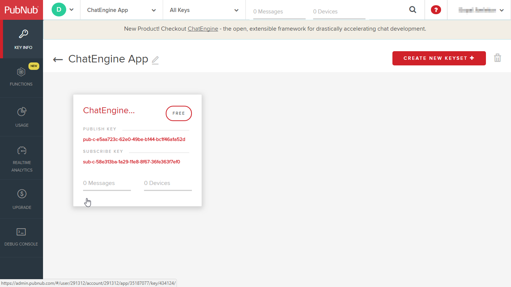

* On the next screen, click the copy buttons towards right side of the keys and copy both publish and subscribe keys in a text file on your PC. We will use them later.

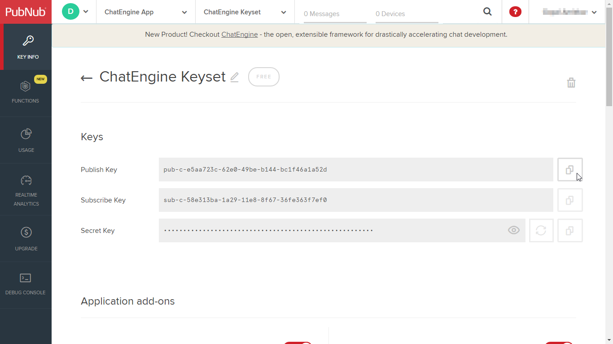


###### Step 10:

* From the left side bar, click on FUNCTIONS. You can see the function is already created for Chat Engine. Click on the function box.

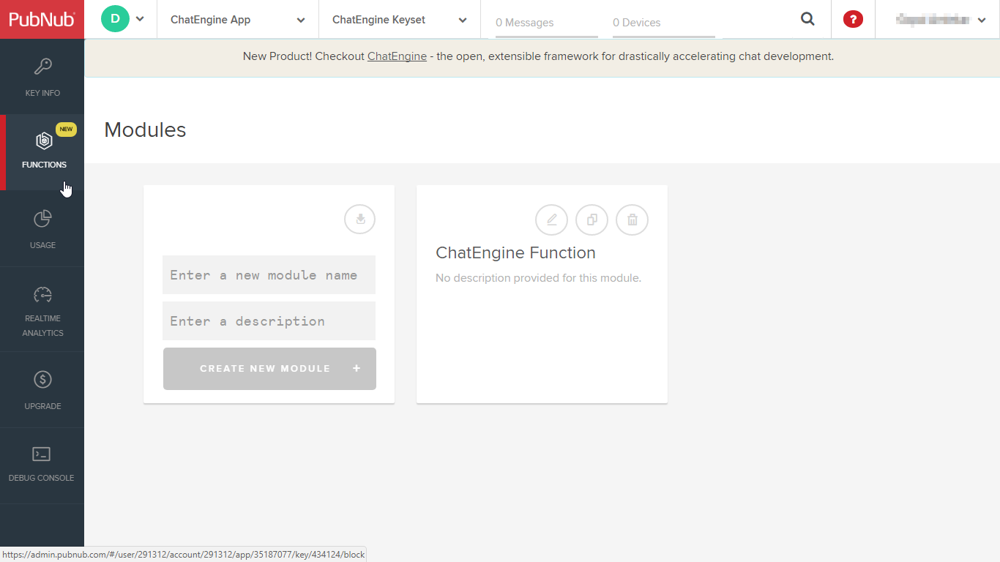

* Within the function, two modules are already created and running. These are required for Chat Engine functionality. We need to create one more module within this function to access Watson conversation service from within PubNub. Click on the '+CREATE' button which will pop-up a 'Create a New Function' dialog box.

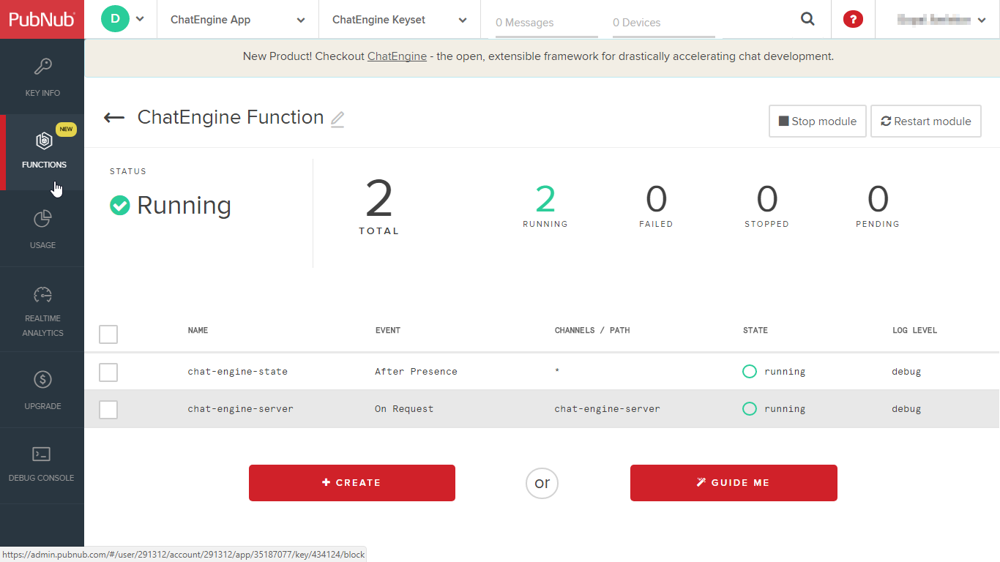


###### Step 11:

* In the dialog box to create a new function module, enter a name, select trigger as 'Before Publish or Fire' and put an asterisk in the channel name box. Then click on 'CREATE' button on the dialog box.

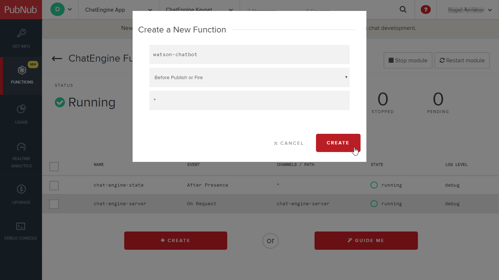


###### Step 12:

* A new function will be created with a default code. Replace this default code with the code from file [chatbot-pubnub-function.js](watson-chatbot/chatbot-pubnub-function.js).

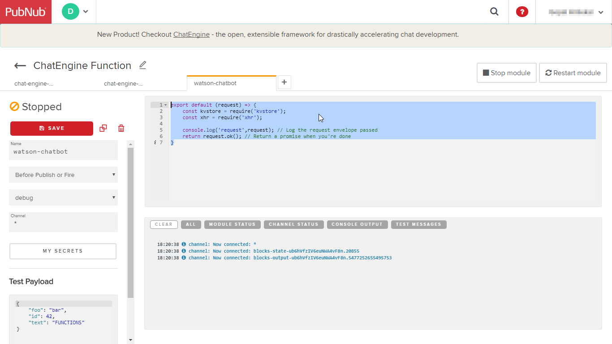

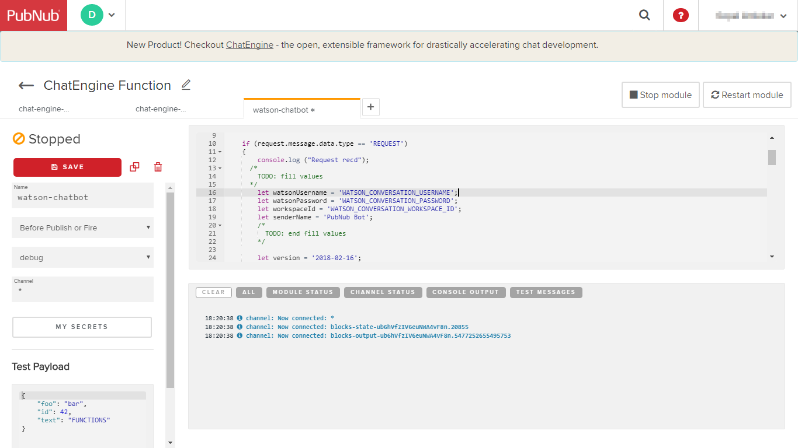

* Replace the Watson credentials in this code with your Watson conversation service credentials obtained in step 4 earlier.

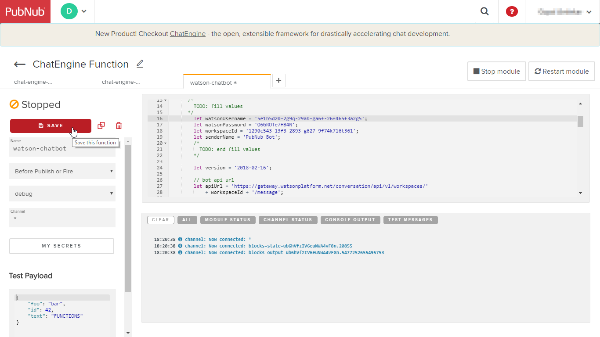

* Save the newly created module by clicking on 'SAVE' button and then restart the module by clicking on 'Restart module' button.

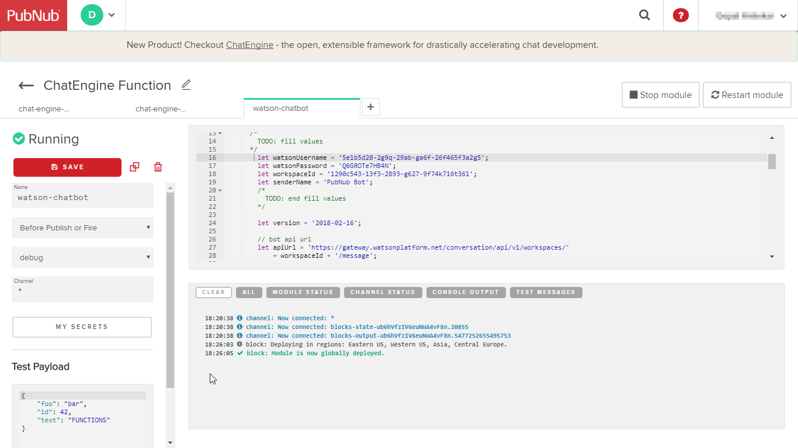

### Configure PubNub ChatEngine

Our PubNub function is now running and Watson conversation service is also setup. The next and final steps are to run the chat app locally and talk to your home.

###### Step 13:

* Open the file [chat.js](userapp/scripts/chat.js) from the `userapp/scripts` folder. Replace the publish, subscribe keys in the file with your own publish, subscribe keys obtained in step 9 earlier. Save the file when done.

```javascript
pubnub_pub_key = 'YOUR_PUBNUB_PUBLISH_KEY';
pubnub_sub_key = 'YOUR_PUBNUB_SUBSCRIBE_KEY'
```

###### Step 14:

* Similar to step 13, put your PubNub publish, subscribe keys in the [chat.js](homesimulator/scripts/chat.js) file from `homesimulator/scripts` folder as well and save the file.

```javascript
pubnub_pub_key = 'YOUR_PUBNUB_PUBLISH_KEY';
pubnub_sub_key = 'YOUR_PUBNUB_SUBSCRIBE_KEY'
```

###### Step 15:
Now open the file [homeView.html](homesimulator/homeView.html) in your browser and then in another browser open the file [chat.html](userapp/chat.html).

You can see that chat window shows two users online. One user is yourself and the other is your home.

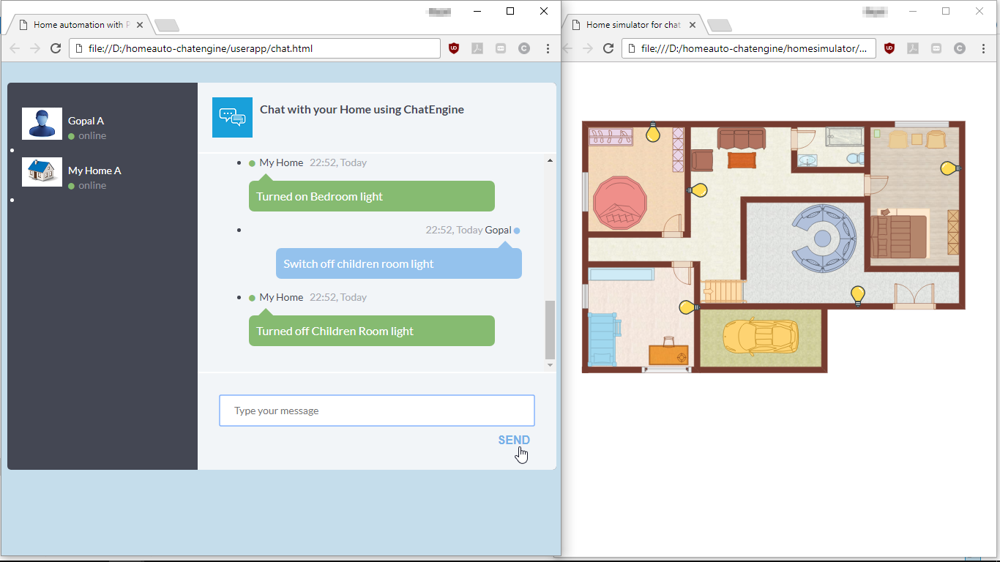


 You can have a chat with your home now. Try giving a few commands like 'turn off Kitchen light' or 'turn off bedroom light' and you can see the bulbs in home simulator being switched off / on as per the command.

 You are done!
